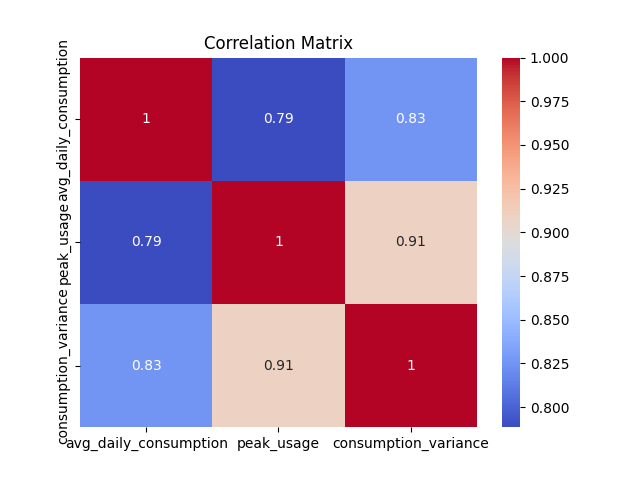
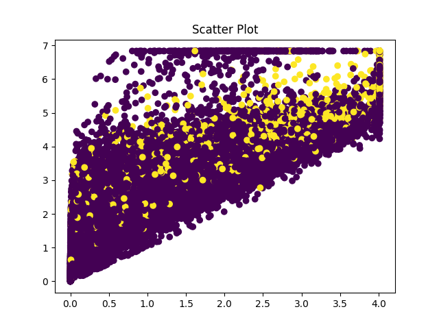
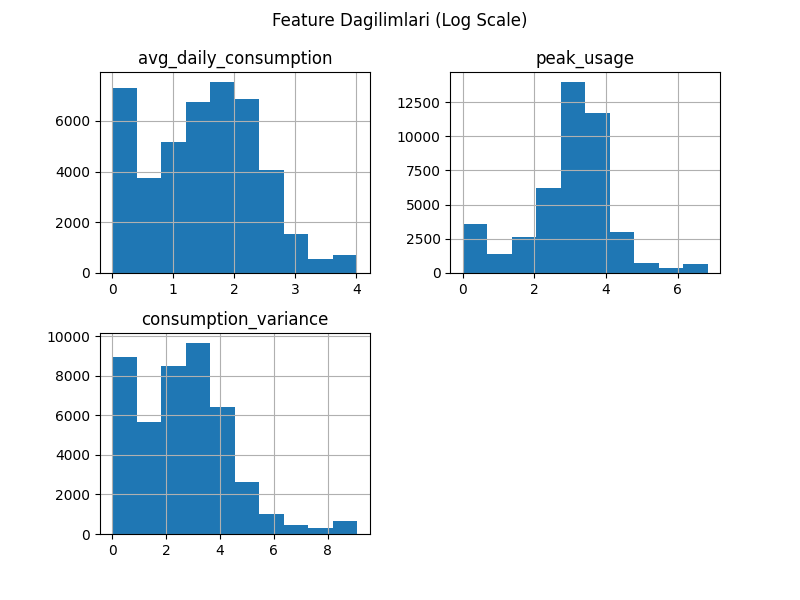
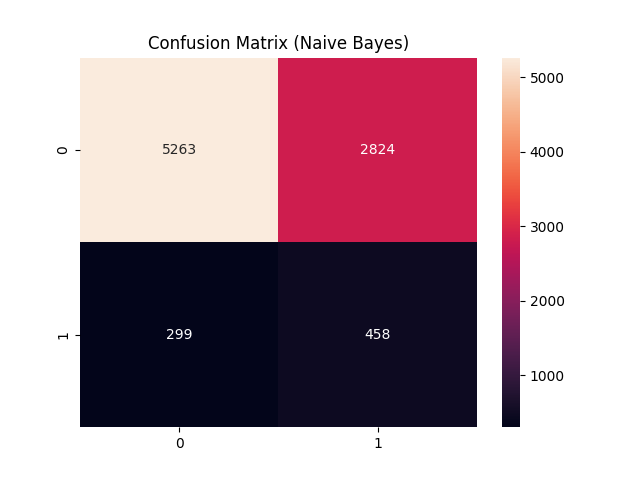
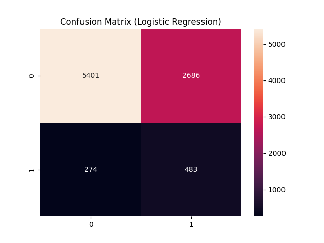

Electricity Theft Detection Using Machine Learning

1. Introduction

Electricity theft represents a major challenge for energy distribution systems, leading to significant economic losses and operational inefficiencies. Detecting fraudulent consumption patterns is therefore critical for ensuring system reliability and sustainability.

This project presents a machine learning-based approach for identifying electricity theft by analyzing consumption data and classifying users as fraudulent or non-fraudulent.

---

2. Objective

The main objectives of this study are:

* To identify abnormal electricity consumption patterns
* To classify users based on fraudulent behavior
* To evaluate the performance of different machine learning models
* To improve classification performance through data preprocessing and balancing techniques

---

3. Dataset and Preprocessing

3.1 Data Cleaning

* Missing values were handled using median imputation
* Duplicate records were removed
* Irrelevant columns (e.g., unnamed indices) were dropped

3.2 Feature Engineering

* Features (X) represent electricity consumption characteristics
* Target variable (y) is defined as `IsStealer`

3.3 Data Scaling

* Standardization was applied using StandardScaler to normalize feature distributions

3.4 Class Imbalance Handling

* SMOTE (Synthetic Minority Oversampling Technique) was used to balance the dataset

---

4. Methodology

Two machine learning models were implemented and compared:

* Logistic Regression
* Random Forest Classifier

The dataset was divided into training and testing sets, and both models were trained on the processed data.

---

5. Evaluation Metrics

The performance of the models was evaluated using the following metrics:

* Accuracy
* Precision
* Recall
* F1-score
* ROC-AUC

---

6. System Architecture

The system follows a structured pipeline:

1. Data Loading
2. Data Preprocessing
3. Feature Scaling
4. Class Balancing (SMOTE)
5. Model Training
6. Model Evaluation
7. Visualization of Results

---

7. Results and Visualizations

7.1 Correlation Matrix

The correlation matrix illustrates relationships between features and helps identify dependencies in the dataset.

---

7.2 Scatter Plot Analysis

Scatter plots provide insight into the distribution of data and potential separability between classes.

---

7.3 Log Scale Visualization

Logarithmic scaling improves visualization of skewed data distributions.

---

7.4 Confusion Matrix (Random Forest)

The confusion matrix presents classification performance by comparing predicted and actual labels.

---

7.5 Confusion Matrix (Logistic Regression)

This matrix shows the classification performance of the logistic regression model.

---

8. Technologies Used

* Python
* NumPy
* Pandas
* Matplotlib
* Seaborn
* Scikit-learn
* Imbalanced-learn (SMOTE)

---

9. Conclusion

This study demonstrates that machine learning techniques can effectively detect electricity theft by analyzing consumption patterns. The use of preprocessing, feature scaling, and class balancing significantly improves model performance.

Among the evaluated models, ensemble-based approaches such as Random Forest generally provide more robust results compared to linear models.

---

10. Future Work

* Integration with real-time monitoring systems
* Use of deep learning models
* Feature selection and optimization
* Deployment as a web-based or embedded system

---